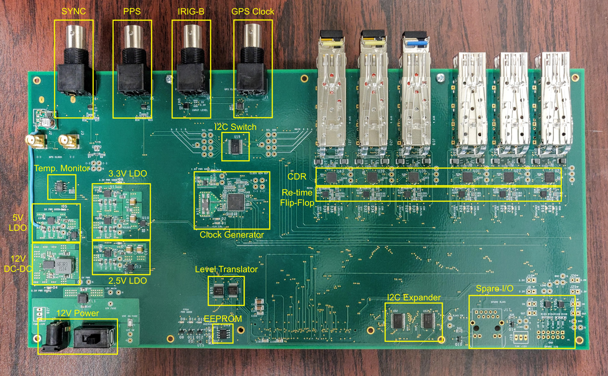

# GIB Hardware

### Power
The GIB uses +12V power with a 4A inline fuse. A standard size barrel connector supplies all the power to the board. A switch near the barrel connector can be used to switch on/off the board.

### GPS Inputs

**GPS Clock**  

The input expects to receive a 10MHz sine wave from the GPS receiver. The input can handle amplitudes from 200mV to 2.0V.

**IRIG-B** 

The input expects to receive the IRIG-B timecode from the GPS receiver. A 100 b/s code on a 1kHz carrier square wave. Located just beind the BNC connector are two resistors R266 (3.3V) and R265 (5.0V) which can be used to set the input voltage level, e.g. using R266 for 3.3V input level.

**PPS & SYNC** 

This is for optional PPS and SYNC inputs with a 5V logic level.

**SFPs** 

The SFP use standard modules.

### Ouputs

**GPS Clock** 

The input GPS clock sine wave is converted to an LVDS logic signal with two outputs. One is sent to the SI5395 clock generator to create additional syncronous clocks while the other is sent to output SMA connectors. One is the positive and the other the negative. These outputs can be used to oberve the  clock on a scope.

### Motherboard

* Enclustra PM3 base board (recommend XC7A100T) [link here](https://www.enclustra.com/en/products/base-boards/mars-pm3/)
* Enclustra AX3 FPGA module [link here](https://www.enclustra.com/en/products/fpga-modules/mars-ax3/)
